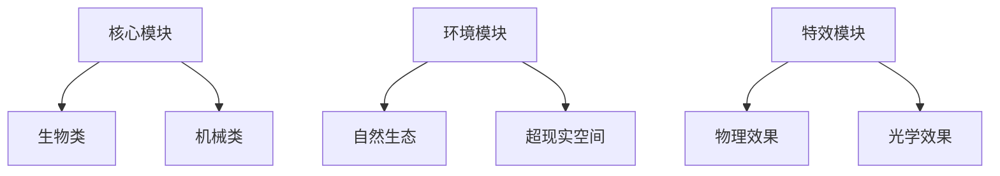

以下是针对您当前系统的优化方案及扩展建议，采用模块化设计思维与渐进式交互理念：

---

### **一、模块库深度优化方案**
#### 主体模块扩展
| 主分类 | 二级分类 | 三级选项 | 参数控制项 | 视觉标识 |
|--------|----------|----------|------------|----------|
| **人物** | 性别 | 男性/女性/无性别 | 年龄滑块(儿童→老人) | 动态3D模型 |
|         | 职业 | 武士/科学家/机甲师 | 服装复杂度(1-5级) | 职业图标+粒子特效 |
|         | 体型 | 标准/肌肉/纤细 | BMI指数调节 | 比例尺叠加 |
| **动物** | 物种 | 熊猫/龙/机械兽 | 毛发质感(光滑→粗糙) | Lottie动画 |
|         | 状态 | 战斗/休息/飞行 | 动态强度调节 | 动作捕捉预览 |
| **载具** | 类型 | 蒸汽机车/悬浮艇 | 锈蚀程度(0-100%) | 材质贴图切换 |
|         | 动力 | 核能/魔法/生物 | 能量光效强度 | 流光粒子引擎 |
| **建筑** | 风格 | 新中式/哥特/赛博 | 破损效果(全新→废墟) | AR透视结构 |

#### 新增模块类型


---

### **二、界面交互升级方案**
#### 1. 三维层级导航系统
```tsx
<ModulePanel>
  <CategoryTab title="人物" icon="👤">
    <SubCategoryCarousel items={['性别','职业','装备']} />
    <AttributePanel>
      <ParamKnob label="年龄" min={5} max={80} />
      <TexturePicker options={['丝绸','金属','生化皮肤']} />
    </AttributePanel>
  </CategoryTab>
</ModulePanel>
```

#### 2. 智能组合推荐引擎
```javascript
// 当选择「黄铜朋克」时自动触发
const recommendedCombos = {
  environment: ['蒸汽都市夜景', '齿轮雨'],
  vehicles: ['蒸汽飞艇', '发条马车'],
  effects: ['油渍反光', '铜绿腐蚀']
};
```

#### 3. 混合现实参数调节
- 旋转3D模型实时改变观察角度
- 捏合手势调整模块尺寸
- 语音指令修改数值参数("把雨量调大到70%")

---

### **三、视觉呈现增强方案**
#### 参数控制界面设计
```markdown
[机甲战士模块]
├─ 主体强度: ▮▮▮▮▯ (80%)
├─ 风格混合: 
   ├─ 黄铜朋克 ●○○○
   └─ 水墨 ○●○○
└─ 环境互动: 
   ├─ 雨天强度: 🌧️▮▮▮▯
   └─ 风力方向: ↑←→↓ (可拖拽箭头)
```

#### 实时预览面板
```typescript
interface LivePreview {
  mainSubject: Subject3D; // 带骨骼动画的3D模型
  styleOverlay: ShaderTexture; // 实时风格迁移
  environmentMap: HDRi; // 动态光影计算
  particleEffects: GPUParticles; // 物理模拟特效
}
```

---

### **四、技术实现路径**
1. **数据结构优化**
```typescript
type ModuleConfig = {
  id: string;
  type: 'CORE' | 'STYLE' | 'ENV';
  attributes: {
    requiredSlots: string[]; // 需要配合的模块类型
    conflictRules: string[]; // 互斥模块ID
    parameters: Record<string, ParameterConfig>;
  };
};

interface ParameterConfig {
  controlType: 'slider' | 'color' | 'vector3';
  min?: number;
  max?: number;
  step?: number;
  visualizer?: 'waveform' | 'spectrum'; // 专属可视化方案
}
```

2. **推荐工作流**
```bash
1. 使用 Three.js + React-Three-Fiber 构建3D编辑器
2. 集成 TensorFlow.js 实现风格迁移预览
3. 采用 WebXR 实现混合现实调节
4. 使用 Web Audio API 制作参数反馈音效
```

---

### **五、扩展性设计**
1. **用户自定义模块系统**
   - 上传3D模型自动生成参数控制项
   - 录制动作捕捉数据创建新动画
   - 训练个人风格迁移模型

2. **社区模块工坊**
   - 热门模块排行榜
   - 组合方案一键导入
   - 参数配置云端同步

---

此方案通过层级化分类与物理化交互，将复杂度隐藏在直观操作中。当用户选择「人物→武士」时，会自动展开刀剑类型选择与战斗姿态预设；选择「建筑→赛博」则会激活霓虹灯参数与全息广告选项。建议先实现核心参数联动系统，再逐步添加高级可视化功能。