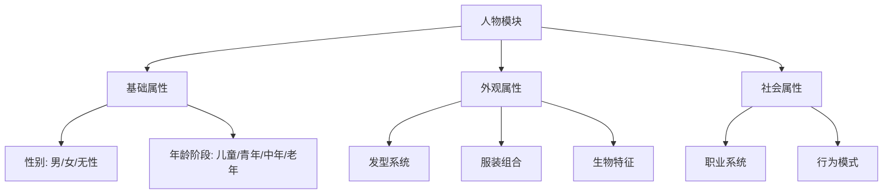
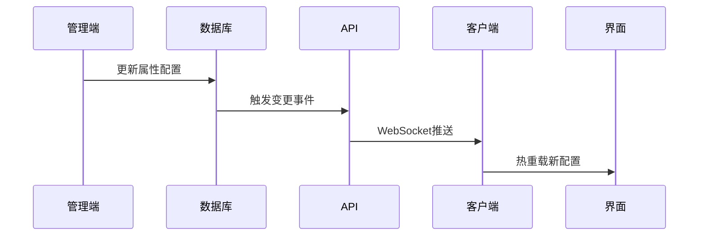

以下是为「人物模块」设计的动态属性架构方案，采用可扩展的JSON Schema + 可视化关联系统：

---

### **人物模块层级架构**


---

### **数据结构设计**
```typescript
// 数据库模型
interface CharacterModule {
  id: string;
  type: 'CHARACTER';
  coreAttributes: {
    gender: 'male' | 'female' | 'neutral';
    ageStage: 'child' | 'youth' | 'middle' | 'elder';
  };
  dynamicAttributes: DynamicAttribute[];
}

interface DynamicAttribute {
  category: 'APPEARANCE' | 'SOCIAL';
  key: string; // 例如 'hairstyle'
  label: string;
  controlType: 'SELECT' | 'COLOR_PICKER' | 'SLIDER';
  options: AttributeOption[] | ParamRange;
  dependencies: string[]; // 依赖的上级属性
  connectorStyle: {  // 连线样式
    color: string;
    pattern: 'solid' | 'dashed';
  };
}

interface AttributeOption {
  value: string;
  preview: string; // 图片/3D模型路径
  subParams?: {  // 嵌套参数
    key: string;
    controls: ParamConfig[];
  };
}
```

---

### **界面交互流程**
1. **模块激活逻辑**
```javascript
// 当人物模块被拖入画布时
function handleCharacterDrop() {
  unlockAttributes(['APPEARANCE', 'SOCIAL']);
  showFloatingPalette({
    position: 'right-sidebar',
    animation: 'slide-in'
  });
}
```

2. **属性关联可视化**
```tsx
<AttributeConnector 
  sourceId="character-123" 
  targetId="hairstyle-456"
  style={{
    stroke: '#FF6B6B',
    strokeWidth: 2,
    markerEnd: 'url(#arrow-head)'
  }}
/>
```

3. **动态参数生成器**
```tsx
<DynamicForm
  schema={currentAttribute.options}
  onChange={(values) => updateCharacterParams(values)}
  components={{
    SLIDER: ({ config }) => (
      <RangeSlider 
        min={config.min} 
        max={config.max}
        step={config.step || 1}
      />
    ),
    COLOR_GRID: ({ options }) => (
      <ColorSwatchGrid colors={options} />
    )
  }}
/>
```

---

### **可扩展属性库示例**
| 属性分类 | 属性项 | 控制类型 | 嵌套参数示例 |
|----------|--------|----------|--------------|
| **发型系统** | 发型类型 | 图标选择 | 发色选择、长度滑块、光泽度 |
| **服装组合** | 上衣类型 | 3D预览选择 | 材质选择、破损度、花纹密度 |
| **生物特征** | 瞳孔形状 | 矢量图形编辑 | 发光强度、异变程度 |
| **职业系统** | 职业类型 | 卡片式选择 | 工具选择、技能特效开关 |
| **行为模式** | 情绪状态 | 表情轮盘 | 动作幅度、能量粒子强度 |

---

### **数据库存储方案**
```json
{
  "character_modules": {
    "fields": [
      {"name": "core_attributes", "type": "JSONB"},
      {"name": "dynamic_config", "type": "JSONB"},
      {"name": "version_control", "type": "HSTORE"}
    ],
    "indexes": [
      {"fields": ["dynamic_config->'category'"], "type": "GIN"}
    ]
  },
  "attribute_templates": {
    "relations": {
      "belongsTo": "character_modules",
      "through": "attribute_bindings"
    }
  }
}
```

---

### **管理系统设计**
1. **属性配置界面**
```tsx
<AttributeAdminPanel>
  <Tabs>
    <Tab label="基础模板">
      <TemplateUploader accept=".schema.json" />
    </Tab>
    <Tab label="实时预览">
      <PreviewViewport 
        type="character" 
        syncWith="configForm"
      />
    </Tab>
  </Tabs>
</AttributeAdminPanel>
```

2. **版本控制机制**
```bash
# 修改历史记录格式
v1.2.3 | 2023-08-20 | 新增赛博义眼参数组
   - 增加瞳孔发光强度控件
   - 添加虹膜纹理选项
   - 修复服装材质冲突问题
```

---

### **技术实现路径**
1. **前端架构**
```bash
使用以下技术栈组合：
- 拖拽系统：React-DnD + React-Flow
- 动态表单：React-JSONSchema-Form
- 3D预览：React-Three-Fiber
- 状态管理：Zustand + Immer
```

2. **后端服务**
```javascript
// 动态属性API示例
app.put('/api/attributes/:id', async (req) => {
  const schema = validateWithAJV(req.body);
  const versioned = applyVersioning(schema);
  await db.updateAttribute(versioned);
  broadcastUpdateToClients(); // WebSocket推送更新
});
```

3. **实时同步流程**


---

此方案可实现：  
✅ 性别年龄与附加属性的智能联动  
✅ 可视化参数关联系统  
✅ 动态扩展的业务属性  
✅ 实时配置同步机制  

建议部署顺序：  
1. 先实现核心属性绑定系统  
2. 建立基础属性模板库  
3. 开发管理员配置界面  
4. 最后添加实时预览与版本控制